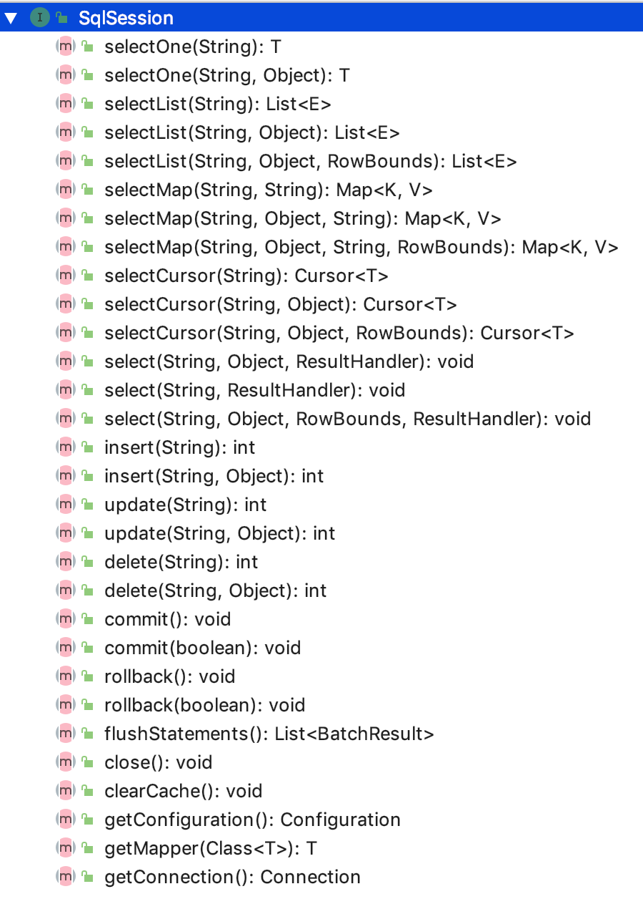
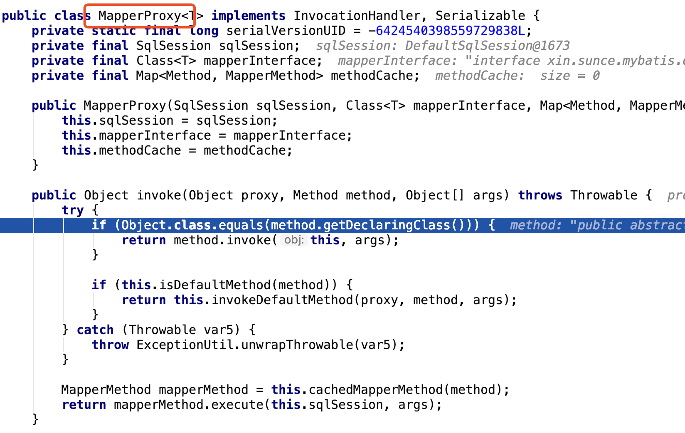
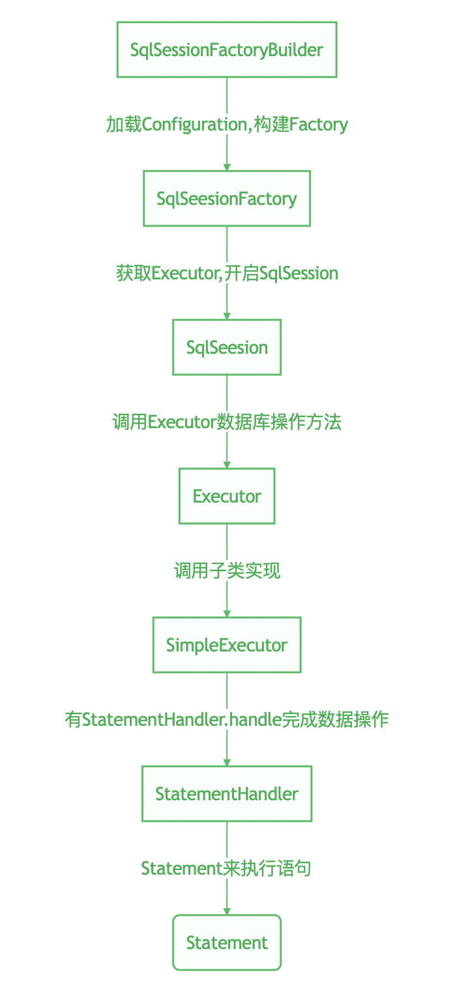

### MyBatis使用以及源码浅析

MyBatis是一个普遍应用并且十分优秀的持久层框架；本文将简单介绍MyBatis的使用，同时也将分析其在代码层面是如何实现的；本文的演示环境如下：
* JDK1.8 
* mysql 8.0.15
* MyBatis 3.4.6

#### MyBatis的使用

##### 构建SqlSessionFactory

每个基于MyBatis的应用都是以SqlSessionFactory为核心的，SqlSessionFactory可以通过SqlSessionFactoryBuilder来构建；常用的有两种方式，一种是通过XML配置构建，而另一种则是通过Configuration实例对象来构建；

通过XML构建：
```
String resource = "org/mybatis/example/mybatis-config.xml";
//读取XML配置文件
InputStream inputStream = Resources.getResourceAsStream(resource);
//构建SqlSessionFactory
SqlSessionFactory sqlSessionFactory = new SqlSessionFactoryBuilder().build(inputStream);
```
XML配置文件内容如下：
```
<?xml version="1.0" encoding="UTF-8" ?>
<!DOCTYPE configuration
  PUBLIC "-//mybatis.org//DTD Config 3.0//EN"
  "http://mybatis.org/dtd/mybatis-3-config.dtd">
<configuration>
  <environments default="development">
    <environment id="development">
      <transactionManager type="JDBC"/>
      <dataSource type="POOLED">
        <property name="driver" value="${driver}"/>
        <property name="url" value="${url}"/>
        <property name="username" value="${username}"/>
        <property name="password" value="${password}"/>
      </dataSource>
    </environment>
  </environments>
  <mappers>
    <mapper resource="org/mybatis/example/BlogMapper.xml"/>
  </mappers>
</configuration>
```

通过Configuration实例对象来构建：
```
DataSource dataSource = BlogDataSourceFactory.getBlogDataSource();
TransactionFactory transactionFactory = new JdbcTransactionFactory();
Environment environment = new Environment("development", transactionFactory, dataSource);
//配置Configuration对象，跟XML做了相同的事情
Configuration configuration = new Configuration(environment);
configuration.addMapper(BlogMapper.class);
//构建SqlSessionFactory
SqlSessionFactory sqlSessionFactory = new SqlSessionFactoryBuilder().build(configuration);
```

##### 获取 SqlSession
获取到SqlSessionFactory以后，我们便可以获取到SqlSession，最后便可以执行已经映射的SQL语句了；具体代码如下：

```
//获取SqlSession
SqlSession session = sqlSessionFactory.openSession();
```

##### 执行SQL语句

执行SQL语句的方法也并非只用一种，亦可以直接通过SqlSession来执行

通过SqlSession执行
```
SqlSession session = sqlSessionFactory.openSession();
try {
  Blog blog = (Blog) session.selectOne("org.mybatis.example.BlogMapper.selectBlog", 101);
} finally {
  session.close();
}

```


通过获取Mapper来执行
```
SqlSession session = sqlSessionFactory.openSession();
try {
  //获取已经映射的Mapper
  BlogMapper mapper = session.getMapper(BlogMapper.class);
  //执行Mapper中的SQL语句
  Blog blog = mapper.selectBlog(101);
} finally {
  session.close();
}
```
随后会在下文针对映射语句，执行语句进行较为详细的介绍。

##### 映射的SQL语句

```
<?xml version="1.0" encoding="UTF-8" ?>
<!DOCTYPE mapper
  PUBLIC "-//mybatis.org//DTD Mapper 3.0//EN"
  "http://mybatis.org/dtd/mybatis-3-mapper.dtd">
  <mapper namespace="org.mybatis.example.BlogMapper">
  <select id="selectBlog" resultType="Blog">
    select * from Blog where id = #{id}
  </select>
</mapper>
```

当然，映射的SQL语句也是不应定必须通过XML文件来完成的，也是可以通过注解来实现的
```
package org.mybatis.example;
public interface BlogMapper {
  @Select("SELECT * FROM blog WHERE id = #{id}")
  Blog selectBlog(int id);
}
```
对于简单的SQL语句，通过注解的方式，你会觉得十分的得心应手；然而实现复杂的SQL则会有些混乱和力不从心；使用者可以根据自己的需求来使用，而不用单单被局限于其中的某一种形式。

##### 作用域以及生命周期

依赖注入框架会创建线程安全的SqlSession和Mapper并将它们注入到你的bean中，因此你可以直接忽略它们的生命周期；如何通过依赖注入框架来使用MyBatis，后面我们将会介绍；你也可以参看MyBatis-Spring。

**SqlSessionFactoryBuilder**

这个类可以被实例化，创建以及销毁，一旦在其创建SqlSessionFactory,其实就不需要它了；所以它最好的作用域就是方法作用域（局部方法），当然你可以通过它创建多个SqlSessionFactory实例，当然最好不要让SqlSessionFactoryBuilder一直存在，以保证XML资源被用于更重要的事情。

**SqlSessionFactory**

SqlSessionFactory一旦被创建就应该在应用运行期间一直存在；它不应该被频繁的销毁创建，所以它的作用域应该是应用作用域；最好通过单例模式来使用。

**SqlSession**

每个线程都应该有自己的SqlSession，SqlSession不是线程安全的，所以它不能被线程共享，所以SqlSession不能被置于静态类，或者一个类的实例变量；所以它的作用域最好是请求或者方法。例如在HTTP请求中，应该每次收到一个请求，便打开一个SqlSession，响应之后，立即关闭SqlSession。

**Mapper 实例**

通过使用的Demo，我们也知道Mapper 实例是通过SqlSession获得的，所以它的作用域也是方法作用域。


以上MyBatis使用指南，[主要参考MyBatis官方文档](http://www.mybatis.org/mybatis-3/zh/getting-started.html)

#### 源码解读

了解以上知识，让我们对MyBatis有了进一步的了解；便于我们捕捉源码的阅读方向；我们知道SqlSessionFactory是通过SqlSessionFactoryBuilder来构建的，接下来我们首先来看看它；

##### SqlSessionFactoryBuilder


我们看到SqlSessionFactoryBuilder中有这各式各样的build方法；最终都调用到如下方法：

```

//在这里读取到的配置文件会通过XMLConfigBuilder被转换成Configuration实例，调用“最终方法”
public SqlSessionFactory build(InputStream inputStream, String environment, Properties properties) {
    SqlSessionFactory var5;
    try {
        XMLConfigBuilder parser = new XMLConfigBuilder(inputStream, environment, properties);
        //XMLConfigBuilder的实例调用parse()，最终返回Configuration实例
        var5 = this.build(parser.parse());
    } catch (Exception var14) {
        throw ExceptionFactory.wrapException("Error building SqlSession.", var14);
    } finally {
        ErrorContext.instance().reset();

        try {
            inputStream.close();
        } catch (IOException var13) {
        }

    }

    return var5;
}

// 最终方法：通过Configuration实例来构建
public SqlSessionFactory build(Configuration config) {
    return new DefaultSqlSessionFactory(config);
}
```

以上代码也印证了我们主要介绍的两种方法来构建SqlSessionFactory，最终会返回一个DefaultSqlSessionFactory实例。

##### SqlSessionFactory


我们可以看到SqlSessionFactory主要提供了开启SqlSession以及获取Configuration的方法；知道了接口作用，我们再来看看默认的实现类DefaultSqlSessionFactory。获取SqlSession最终都交给了两个私有的方法：openSessionFromDataSource，openSessionFromConnection；顾名思义分别是通过数据源来获取，通过连接来获取；两个方法大同小异，我们来详细看看其中一个。

```
private SqlSession openSessionFromDataSource(ExecutorType execType, TransactionIsolationLevel level, boolean autoCommit) {
    Transaction tx = null;

    DefaultSqlSession var8;
    try {
        //获取环境
        Environment environment = this.configuration.getEnvironment();
        //获取事务工厂
        TransactionFactory transactionFactory = this.getTransactionFactoryFromEnvironment(environment);
        //获取事务
        tx = transactionFactory.newTransaction(environment.getDataSource(), level, autoCommit);
        //获取执行器
        Executor executor = this.configuration.newExecutor(tx, execType);
        //获取SqlSession，默认实现是DefaultSqlSession
        var8 = new DefaultSqlSession(this.configuration, executor, autoCommit);
    } catch (Exception var12) {
        this.closeTransaction(tx);
        throw ExceptionFactory.wrapException("Error opening session.  Cause: " + var12, var12);
    } finally {
        ErrorContext.instance().reset();
    }

    return var8;
}
```

以上便是创建SqlSeesion的过程，利用public DefaultSqlSession(Configuration configuration, Executor executor) 此构造方法来获取SqlSession实例。

##### SqlSession



我们发现SqlSession提供了所有对数据库的操作，各式各样的增删改查，以及获取映射Mapper的方法；接下来我们仔细研读一下默认的实现类DefaultSqlSession

```
public class DefaultSqlSession implements SqlSession {

    private final Configuration configuration;
    private final Executor executor;
    private final boolean autoCommit;
    private boolean dirty;
    private List<Cursor<?>> cursorList;

    public DefaultSqlSession(Configuration configuration, Executor executor, boolean autoCommit) {
        this.configuration = configuration;
        this.executor = executor;
        this.dirty = false;
        this.autoCommit = autoCommit;
    }

    public DefaultSqlSession(Configuration configuration, Executor executor) {
        this(configuration, executor, false);
}

.....
//查询示例
 public <E> List<E> selectList(String statement, Object parameter, RowBounds rowBounds) {
    List var5;
    try {
        MappedStatement ms = this.configuration.getMappedStatement(statement);
        var5 = this.executor.query(ms, this.wrapCollection(parameter), rowBounds, Executor.NO_RESULT_HANDLER);
    } catch (Exception var9) {
        throw ExceptionFactory.wrapException("Error querying database.  Cause: " + var9, var9);
    } finally {
        ErrorContext.instance().reset();
    }

    return var5;
}

.....
//更新示例
public int update(String statement, Object parameter) {
    int var4;
    try {
        this.dirty = true;
        MappedStatement ms = this.configuration.getMappedStatement(statement);
        var4 = this.executor.update(ms, this.wrapCollection(parameter));
    } catch (Exception var8) {
        throw ExceptionFactory.wrapException("Error updating database.  Cause: " + var8, var8);
    } finally {
        ErrorContext.instance().reset();
    }

    return var4;
}
.....


```
我们发现在DefaultSqlSession实现类中SqlSeesion封装的对数据库的操作最终都是有Executor来执行的；相当于SqlSeesion提供对数据库相应的操作，而具体的职责是有Executor来完成的。

##### Executor
下图是Executor的主要功能


下图是Executor的继承实现关系


Executor在SqlSessionFactory开启SqlSession时创建，代码片段如下：
```
public SqlSession openSession() {
        return this.openSessionFromDataSource(this.configuration.getDefaultExecutorType(), (TransactionIsolationLevel)null, false);
}

.....
//如下会依据ExecutorType类型来创建执行器，进而创建SqlSession实例对象
//从openSession方法，我们看到的使用的是configuration类中默认的ExecutorType
//从Configuration构造方法中我们找到默认的执行器类型是ExecutorType.SIMPLE;

private SqlSession openSessionFromDataSource(ExecutorType execType, TransactionIsolationLevel level, boolean autoCommit) {
    .......   
    Executor executor = this.configuration.newExecutor(tx, execType);
    var8 = new DefaultSqlSession(this.configuration, executor, autoCommit);
    ......
    return var8;
}

.....
//Configuration中newExecutor获取执行器代码如下

public Executor newExecutor(Transaction transaction, ExecutorType executorType) {
    executorType = executorType == null ? this.defaultExecutorType : executorType;
    executorType = executorType == null ? ExecutorType.SIMPLE : executorType;
    Object executor;
    if (ExecutorType.BATCH == executorType) {
        executor = new BatchExecutor(this, transaction);
    } else if (ExecutorType.REUSE == executorType) {
        executor = new ReuseExecutor(this, transaction);
    } else {
        executor = new SimpleExecutor(this, transaction);
    }

    if (this.cacheEnabled) {
        executor = new CachingExecutor((Executor)executor);
    }

    Executor executor = (Executor)this.interceptorChain.pluginAll(executor);
    return executor;
}
```

找到Executor以后，我们离真相又近了一步；Executor从设计上就考虑到了缓存，我们可以从createCacheKey，clearLocalCache等方法看到其设计的巧妙之处；这里我们先忽略缓存设计（后面会做详细说明），我们先来看看它的抽象类BaseExecutor；


我们看到BaseExecutor对Executor接口进行了实现，最终调用抽象方法doXX；需要交由子类去实现。以doUpdate，doQuery为例，我们来看看子类实现。

```
//更新方法
public int doUpdate(MappedStatement ms, Object parameter) throws SQLException {
    Statement stmt = null;

    int var6;
    try {
        Configuration configuration = ms.getConfiguration();
        StatementHandler handler = configuration.newStatementHandler(this, ms, parameter, RowBounds.DEFAULT, (ResultHandler)null, (BoundSql)null);
        stmt = this.prepareStatement(handler, ms.getStatementLog());
        var6 = handler.update(stmt);
    } finally {
        this.closeStatement(stmt);
    }

    return var6;
}

//查询方法
public <E> List<E> doQuery(MappedStatement ms, Object parameter, RowBounds rowBounds, ResultHandler resultHandler, BoundSql boundSql) throws SQLException {
    Statement stmt = null;

    List var9;
    try {
        Configuration configuration = ms.getConfiguration();
        StatementHandler handler = configuration.newStatementHandler(this.wrapper, ms, parameter, rowBounds, resultHandler, boundSql);
        stmt = this.prepareStatement(handler, ms.getStatementLog());
        var9 = handler.query(stmt, resultHandler);
    } finally {
        this.closeStatement(stmt);
    }

    return var9;
}
```

最终MappedStatement都是由StatementHandler去执行，至此一个映射语句的完整执行流程就此结束。当然还有一个十分重要的类Configuration，我们再次必须强调一下，Configuration基本存在于整个流程，从通过SqlSessionFactoryBuilder构建SqlSessionFactory，到SqlSessionFactory中Executor的创建，开启SqlSession，再到映射语句的执行。

##### Configuration

还记得我们开篇就提到过Configuration实例有两种构建方式，一种是通过XMLConfigBuilder.parse方法，另一种是利用public Configuration(Environment environment)构造方法；所以Configuration从实质上来说就是XML的java对象表示。


这些元素在Configuration的成员变量中都可以找到。[上图参考](http://www.mybatis.org/mybatis-3/zh/configuration.html)

可能有的同学会好奇Mapper文件是如何配置到Configuration中的，其实在构建Configuration实例的时候，调用的addMappers方法就将Mapper文件注册好了，我们通过以下代码一起来梳理一下

```
//其中一种构建过程
DataSource dataSource = BlogDataSourceFactory.getBlogDataSource();
TransactionFactory transactionFactory = new JdbcTransactionFactory();
Environment environment = new Environment("development", transactionFactory, dataSource);
//配置Configuration对象，跟XML做了相同的事情
Configuration configuration = new Configuration(environment);

//添加Mapper ！！！
configuration.addMapper(BlogMapper.class);

//构建SqlSessionFactory
SqlSessionFactory sqlSessionFactory = new SqlSessionFactoryBuilder().build(configuration);

.....
省略无关代码
.....
public class Configuration {

//mapper注册器
protected final MapperRegistry mapperRegistry;

//添加Mappers到MapperRegistry
public void addMappers(String packageName, Class<?> superType) {
    this.mapperRegistry.addMappers(packageName, superType);
}

public void addMappers(String packageName) {
    this.mapperRegistry.addMappers(packageName);
}

public <T> void addMapper(Class<T> type) {
    this.mapperRegistry.addMapper(type);
}

.....
省略部分代码
.....

//获取Mapper
public <T> T getMapper(Class<T> type, SqlSession sqlSession) {
    return this.mapperRegistry.getMapper(type, sqlSession);
}

}


public class MapperRegistry {

private final Configuration config;
private final Map<Class<?>, MapperProxyFactory<?>> knownMappers = new HashMap();

public MapperRegistry(Configuration config) {
    this.config = config;
}

//获取Mapper
public <T> T getMapper(Class<T> type, SqlSession sqlSession) {
    MapperProxyFactory<T> mapperProxyFactory = (MapperProxyFactory)this.knownMappers.get(type);
    if (mapperProxyFactory == null) {
        throw new BindingException("Type " + type + " is not known to the MapperRegistry.");
    } else {
        try {
            return mapperProxyFactory.newInstance(sqlSession);
        } catch (Exception var5) {
            throw new BindingException("Error getting mapper instance. Cause: " + var5, var5);
        }
    }
}

.....
省略部分代码
.....

//添加Mapper
public <T> void addMapper(Class<T> type) {
    if (type.isInterface()) {
        if (this.hasMapper(type)) {
            throw new BindingException("Type " + type + " is already known to the MapperRegistry.");
        }

        boolean loadCompleted = false;

        try {
            this.knownMappers.put(type, new MapperProxyFactory(type));
            MapperAnnotationBuilder parser = new MapperAnnotationBuilder(this.config, type);
            parser.parse();
            loadCompleted = true;
        } finally {
            if (!loadCompleted) {
                this.knownMappers.remove(type);
            }

        }
    }

}


}    

```

还记得上面执行语句的时候有两种方式，一种是通过SqlSession直接执行，一种是getMapper以后，调用具体的方法。

```
@Test
public void testOriginQuery() {
    SqlSession sqlSession = sessionFactory.openSession();
    try {
      Blog blog = (Blog) session.selectOne("org.mybatis.example.BlogMapper.selectBlog", 101);
    } finally {
      session.close();
    }
}

@Test
public void testQuery() {
    SqlSession session = sqlSessionFactory.openSession();
    try {
      //获取已经映射的Mapper
      BlogMapper mapper = session.getMapper(BlogMapper.class);
      //执行Mapper中的SQL语句
      Blog blog = mapper.selectBlog(101);
    } finally {
      session.close();
    }
}


```
我们在DEBUG testQuery 时，发现执行mapper.selectBlog(101);有代理对象来执行，这是为什么呢？



这是因为我们在session.getMapper(BlogMapper.class); 获取的实际上是MapperRegistry中代理工厂生产的代理对象

```
//获取Mapper
public <T> T getMapper(Class<T> type, SqlSession sqlSession) {
    MapperProxyFactory<T> mapperProxyFactory = (MapperProxyFactory)this.knownMappers.get(type);
    if (mapperProxyFactory == null) {
        throw new BindingException("Type " + type + " is not known to the MapperRegistry.");
    } else {
        try {
            return mapperProxyFactory.newInstance(sqlSession);
        } catch (Exception var5) {
            throw new BindingException("Error getting mapper instance. Cause: " + var5, var5);
        }
    }
}


//MapperProxy工厂
public class MapperProxyFactory<T> {
    private final Class<T> mapperInterface;
    private final Map<Method, MapperMethod> methodCache = new ConcurrentHashMap();

    public MapperProxyFactory(Class<T> mapperInterface) {
        this.mapperInterface = mapperInterface;
    }

    public Class<T> getMapperInterface() {
        return this.mapperInterface;
    }

    public Map<Method, MapperMethod> getMethodCache() {
        return this.methodCache;
    }
    
    //返回代理对象
    protected T newInstance(MapperProxy<T> mapperProxy) {
        return Proxy.newProxyInstance(this.mapperInterface.getClassLoader(), new Class[]{this.mapperInterface}, mapperProxy);
    }
    
    //返回代理对象
    public T newInstance(SqlSession sqlSession) {
        MapperProxy<T> mapperProxy = new MapperProxy(sqlSession, this.mapperInterface, this.methodCache);
        return this.newInstance(mapperProxy);
    }
}

```


通过对源码的分析认识，我们用一张流程图来总结整个流程


