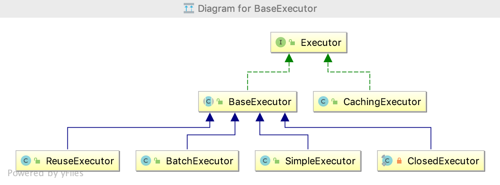

### MyBatis缓存的使用以源码分析

机缘巧合看到2018美团技术年货中介绍了一些MyBatis关于缓存的文章，正好上篇文章对MyBatis的使用以及源码进行了详尽的分析，对于缓存的设计以及使用一笔带过；本文将对MyBatis的缓存进行补充说明。

#### 一级缓存

##### 一级缓存介绍

在应用运行的过程中，一次数据库连接会话可能会多次执行相同的SQL；而MyBatis针对此场景做了优化，优化的方案便是一级缓存；当查询相同的SQL，会优先命中一级缓存，避免了对数据库的多次访问，提高了性能。执行过程如图所示：


(上图来自：美团技术年货)


还记得上篇文章中介绍的SqlSession提供对数据库的操作，而具体的职责是由Executor完成的，那么缓存的是在哪里完成的呢？


当用户执行查询时，MyBatis根据当前语句生成的MapperStatement，在localCache（BaseExecutor的成员变量）中查询，如果命中则直接返回，否则查询数据库，并将结果缓存，最后将数据返回给用户。

一级缓存有两种使用选项，SESSION 或者 STATEMENT，默认的级别是SESSION；SESSION表示再一次数据库会话中执行的所有语句共享一个缓存；而STATEMENT则可以理解为缓存只对当前语句有效。配置方式，在MyBatis配置文件中添加如下：

```
<settings>
    <setting name="localCacheScope" value="SESSION"/>
</settings>
```

##### 一级缓存实验一

我们用以下代码分别对SESSION，STATEMENT做演示
```
//演示代码
@Test
public void test1() {
    SqlSession sqlSession = sessionFactory.openSession(true);
    CustomerDao customerDao;
    try {
        customerDao = sqlSession.getMapper(CustomerDao.class);
        LOGGER.debug(customerDao.selectByPrimaryKey(1L));
        LOGGER.debug(customerDao.selectByPrimaryKey(1L));
        LOGGER.debug(customerDao.selectByPrimaryKey(1L));
    } finally {
        sqlSession.close();
    }
}
```

**SESSION级别演示效果**

```
DEBUG [main] - Created connection 525968792.
DEBUG [main] - ==>  Preparing: select id, optimistic, name, phone from customer where id = ? 
DEBUG [main] - ==> Parameters: 1(Long)
DEBUG [main] - <==      Total: 1
DEBUG [main] - Customer{id=1, optimistic=null, name='ce.sun', phone='null'}
DEBUG [main] - Customer{id=1, optimistic=null, name='ce.sun', phone='null'}
DEBUG [main] - Customer{id=1, optimistic=null, name='ce.sun', phone='null'}
DEBUG [main] - Closing JDBC Connection [com.mysql.cj.jdbc.ConnectionImpl@1f59a598]
DEBUG [main] - Returned connection 525968792 to pool.
```

我们发现只有第一次查询从数据库取得结果，后面的都使用了一级缓存

**STATEMENT级别演示效果**

```
DEBUG [main] - Created connection 525968792.
DEBUG [main] - ==>  Preparing: select id, optimistic, name, phone from customer where id = ? 
DEBUG [main] - ==> Parameters: 1(Long)
DEBUG [main] - <==      Total: 1
DEBUG [main] - Customer{id=1, optimistic=null, name='ce.sun', phone='null'}
DEBUG [main] - ==>  Preparing: select id, optimistic, name, phone from customer where id = ? 
DEBUG [main] - ==> Parameters: 1(Long)
DEBUG [main] - <==      Total: 1
DEBUG [main] - Customer{id=1, optimistic=null, name='ce.sun', phone='null'}
DEBUG [main] - ==>  Preparing: select id, optimistic, name, phone from customer where id = ? 
DEBUG [main] - ==> Parameters: 1(Long)
DEBUG [main] - <==      Total: 1
DEBUG [main] - Customer{id=1, optimistic=null, name='ce.sun', phone='null'}
DEBUG [main] - Closing JDBC Connection [com.mysql.cj.jdbc.ConnectionImpl@1f59a598]
DEBUG [main] - Returned connection 525968792 to pool.
```
当我们将一级缓存的选项调整为STATEMENT时，发现三次都是从数据库取得结果。

##### 一级缓存实验二

使用SESSION一级缓存，当我们在一次会话中对改数据进行修改，会对缓存进行清除么？

```
//演示代码
@Test
public void test2() {
    SqlSession sqlSession = sessionFactory.openSession(true);
    CustomerDao customerDao;
    try {
        customerDao = sqlSession.getMapper(CustomerDao.class);
        Customer customer = customerDao.selectByPrimaryKey(1L);
        LOGGER.debug(customer);
        customer.setName("wang.er");
        customerDao.updateByPrimaryKey(customer);
        LOGGER.debug(customerDao.selectByPrimaryKey(1L));
    } finally {
        sqlSession.close();
    }
}
```
实验结果如下：

```
DEBUG [main] - Created connection 525968792.
DEBUG [main] - ==>  Preparing: select id, optimistic, name, phone from customer where id = ? 
DEBUG [main] - ==> Parameters: 1(Long)
DEBUG [main] - <==      Total: 1
DEBUG [main] - Customer{id=1, optimistic=null, name='wang.er', phone='null'}
DEBUG [main] - ==>  Preparing: update customer set optimistic = ?, name = ?, phone = ? where id = ? 
DEBUG [main] - ==> Parameters: null, wang.er(String), null, 1(Long)
DEBUG [main] - <==    Updates: 1
DEBUG [main] - ==>  Preparing: select id, optimistic, name, phone from customer where id = ? 
DEBUG [main] - ==> Parameters: 1(Long)
DEBUG [main] - <==      Total: 1
DEBUG [main] - Customer{id=1, optimistic=null, name='wang.er', phone='null'}
DEBUG [main] - Closing JDBC Connection [com.mysql.cj.jdbc.ConnectionImpl@1f59a598]
DEBUG [main] - Returned connection 525968792 to pool.
```

一级缓存失效，重新从数据库获取数据。

##### 一级缓存实验三

验证一级缓存SESSION配置，是只在会话内部共享；我们开启两个会话，一个会话查询两次，另一个会话在两次查询期间对查询数据进行修改，会有什么样的结果呢？

```
@Test
public void test3() {
    SqlSession sqlSession1 = sessionFactory.openSession(true);
    SqlSession sqlSession2 = sessionFactory.openSession(true);
    try {
        CustomerDao customerDao1 = sqlSession1.getMapper(CustomerDao.class);
        CustomerDao customerDao2 = sqlSession2.getMapper(CustomerDao.class);
        LOGGER.info("会话一：" + customerDao1.selectByPrimaryKey(1L));
        LOGGER.info("会话一：" + customerDao1.selectByPrimaryKey(1L));
        Customer customer = new Customer();
        customer.setId(1L);
        customer.setName("wang.er");
        customerDao2.updateByPrimaryKey(customer);
        LOGGER.info("会话二：" + customerDao2.selectByPrimaryKey(1L));
        LOGGER.info("会话一：" + customerDao1.selectByPrimaryKey(1L));
    } finally {
        sqlSession1.close();
        sqlSession2.close();
    }
}
```

演示结果
```
DEBUG [main] - Created connection 525968792.
DEBUG [main] - ==>  Preparing: select id, optimistic, name, phone from customer where id = ? 
DEBUG [main] - ==> Parameters: 1(Long)
DEBUG [main] - <==      Total: 1
 INFO [main] - 会话一：Customer{id=1, optimistic=null, name='sun.ce', phone='null'}
 INFO [main] - 会话一：Customer{id=1, optimistic=null, name='sun.ce', phone='null'}
DEBUG [main] - Opening JDBC Connection
DEBUG [main] - Created connection 1431467659.
DEBUG [main] - ==>  Preparing: update customer set optimistic = ?, name = ?, phone = ? where id = ? 
DEBUG [main] - ==> Parameters: null, wang.er(String), null, 1(Long)
DEBUG [main] - <==    Updates: 1
DEBUG [main] - ==>  Preparing: select id, optimistic, name, phone from customer where id = ? 
DEBUG [main] - ==> Parameters: 1(Long)
DEBUG [main] - <==      Total: 1
 INFO [main] - 会话二：Customer{id=1, optimistic=null, name='wang.er', phone='null'}
 INFO [main] - 会话一：Customer{id=1, optimistic=null, name='sun.ce', phone='null'}
DEBUG [main] - Closing JDBC Connection [com.mysql.cj.jdbc.ConnectionImpl@1f59a598]
DEBUG [main] - Returned connection 525968792 to pool.
DEBUG [main] - Closing JDBC Connection [com.mysql.cj.jdbc.ConnectionImpl@5552768b]
DEBUG [main] - Returned connection 1431467659 to pool.
```

我们发现，会话一的结果，没有因为会话二的修改而改变，还是使用了一级缓存的结果；发生了数据脏读。

##### 一级缓存源码分析


从上图中我们能够发现，缓存的重点关注对象是Executor类，我们再来一起回顾一下Executor的继承关系图。



我们先来看看Executor的抽象实现类BaseExecutor

```
//创建CacheKey
@Override
public <E> List<E> query(MappedStatement ms, Object parameter, RowBounds rowBounds, ResultHandler resultHandler) throws SQLEx
ception {
 BoundSql boundSql = ms.getBoundSql(parameter);
 CacheKey key = createCacheKey(ms, parameter, rowBounds, boundSql);
 return query(ms, parameter, rowBounds, resultHandler, key, boundSql);
}
```

具体CacheKey生成规则如下：

```
//CacheKey生成规则
CacheKey cacheKey = new CacheKey();
cacheKey.update(ms.getId());
cacheKey.update(rowBounds.getOffset());
cacheKey.update(rowBounds.getLimit());
cacheKey.update(boundSql.getSql());
//后面是update了sql中带的参数
cacheKey.update(value);
```
以上代码使用MappedStatement的id，SQL的offset、SQL的limit，sql，以及参数生成了CacheKey；我们紧接着看生成CacheKey之后的操作;

```
list = resultHandler == null ? (List)this.localCache.getObject(key) : null;
//如果缓存结果不为空则处理缓存结果
if (list != null) {
    this.handleLocallyCachedOutputParameters(ms, key, parameter, boundSql);
} else {
//否则从数据库查询
    list = this.queryFromDatabase(ms, parameter, rowBounds, resultHandler, key, boundSql);
}
```

我们看到进入query(ms, parameter, rowBounds, resultHandler, key, boundSql)方法后，会先取缓存结果，不存在则从数据库中查询。

```
private <E> List<E> queryFromDatabase(MappedStatement ms, Object parameter, RowBounds rowBounds, ResultHandler resultHandler, CacheKey key, BoundSql boundSql) throws SQLException {
    this.localCache.putObject(key, ExecutionPlaceholder.EXECUTION_PLACEHOLDER);

    List list;
    try {
        list = this.doQuery(ms, parameter, rowBounds, resultHandler, boundSql);
    } finally {
        this.localCache.removeObject(key);
    }
    
    //将数据库中查询的结果缓存起来
    this.localCache.putObject(key, list);
    if (ms.getStatementType() == StatementType.CALLABLE) {
        this.localOutputParameterCache.putObject(key, parameter);
    }

    return list;
}
```
验证完查询的缓存流程，我们再来验证之前实验二中的更新清空缓存，代码如下：
```
public int update(MappedStatement ms, Object parameter) throws SQLException {
        ErrorContext.instance().resource(ms.getResource()).activity("executing an update").object(ms.getId());
    if (this.closed) {
        throw new ExecutorException("Executor was closed.");
    } else {
        //每次更新之前会清空缓存
        this.clearLocalCache();
        return this.doUpdate(ms, parameter);
    }
}
```

我们发现每次更新之前，会先清空缓存，随后在进行更新操作。我们再来仔细看看Cache的具体实现；它是Executor的一个成员变量
```
public abstract class BaseExecutor implements Executor {
    ....
    protected PerpetualCache localCache;
}

```
PerpetualCache 具体代码如下：

```
public class PerpetualCache implements Cache {

    private Map<Object, Object> cache = new HashMap();
    
     public int getSize() {
        return this.cache.size();
    }
    //添加缓存对象
    public void putObject(Object key, Object value) {
        this.cache.put(key, value);
    }
    //获取缓存对象
    public Object getObject(Object key) {
        return this.cache.get(key);
    }
    //移除缓存对象
    public Object removeObject(Object key) {
        return this.cache.remove(key);
    }
    //清空缓存
    public void clear() {
        this.cache.clear();
    }
}    
```


##### 一级缓存总结

* 一级缓存的生命周期跟SqlSession一样
* 一级缓存的实现比较简单通过HashMap
* 一级缓存的最大范围是SESSION，但是在分布式或者多个SqlSession的情况下，有可能会出现数据脏读， 建议使用STATEMENT


#### 二级缓存


##### 二级缓存介绍

我们通过一级缓存了解到，一级缓存的最大范围是SESSION内部，那么在多个SqlSeesion中，如何实现缓存呢？这就需要二级缓存了，回想Executor有两个子类，BaseExecutor跟CachingExecutor；二级缓存就是通过CachingExecutor实现的，如下是二级缓存的工作原理。


二级缓存开启后，同一个namespace下的所有SqlSession共享一个Cache；此时Sql的查询流程是
二级缓存 > 一级缓存 > 数据库

通过在配置文件中，新增如下配置可以打开二级缓存

```
<settings>
    <setting name="cacheEnabled" value="true"/>
</settings>    
```
XML 文件中新增<Cache/>
```
<?xml version="1.0" encoding="UTF-8"?>
<!DOCTYPE mapper PUBLIC "-//mybatis.org//DTD Mapper 3.0//EN" "http://mybatis.org/dtd/mybatis-3-mapper.dtd">
<mapper namespace="xin.sunce.mybatis.dao.StudentDao">
  <cache/>

  <select id="getStudentById" parameterType="int" resultType="xin.sunce.mybatis.entity.Student">
    SELECT id,name,age FROM student WHERE id = #{id}
  </select>
</mapper>  
```


##### 二级缓存实验一

测试二级缓存效果，不提交事务， sqlSession1 查询完数据后， sqlSession2 相同的查询是否会从缓存中获取数据。

```
//演示代码
@Test
public void test1() {
    SqlSession sqlSession1 = sessionFactory.openSession(true);
    SqlSession sqlSession2 = sessionFactory.openSession(true);
    try {
        StudentDao studentDao1 = sqlSession1.getMapper(StudentDao.class);
        StudentDao studentDao2 = sqlSession2.getMapper(StudentDao.class);
        LOGGER.info(studentDao1.getStudentById(1));
        LOGGER.info(studentDao2.getStudentById(1));
    } finally {
        sqlSession1.close();
        sqlSession2.close();
    }
}
```

实验结果：
```
DEBUG [main] - Created connection 1552999801.
DEBUG [main] - ==>  Preparing: SELECT id,name,age FROM student WHERE id = ? 
DEBUG [main] - ==> Parameters: 1(Integer)
DEBUG [main] - <==      Total: 1
 INFO [main] - xin.sunce.mybatis.entity.Student@152aa092
DEBUG [main] - Cache Hit Ratio [xin.sunce.mybatis.dao.StudentDao]: 0.0
DEBUG [main] - Opening JDBC Connection
DEBUG [main] - Created connection 1324578393.
DEBUG [main] - ==>  Preparing: SELECT id,name,age FROM student WHERE id = ? 
DEBUG [main] - ==> Parameters: 1(Integer)
DEBUG [main] - <==      Total: 1
 INFO [main] - xin.sunce.mybatis.entity.Student@37858383
DEBUG [main] - Closing JDBC Connection [com.mysql.cj.jdbc.ConnectionImpl@5c90e579]
DEBUG [main] - Returned connection 1552999801 to pool.
DEBUG [main] - Closing JDBC Connection [com.mysql.cj.jdbc.ConnectionImpl@4ef37659]
DEBUG [main] - Returned connection 1324578393 to pool.
```

我们发现没有命中缓存，会话二重新从数据库中读取

##### 二级缓存实验二

测试二级缓存效果，提交事务， sqlSession1 查询完数据后， sqlSession2 相同的查询是否会从缓存中获取数据。

```
//演示代码
@Test
public void test2() {
    SqlSession sqlSession1 = sessionFactory.openSession(true);
    SqlSession sqlSession2 = sessionFactory.openSession(true);
    try {
        StudentDao studentDao1 = sqlSession1.getMapper(StudentDao.class);
        StudentDao studentDao2 = sqlSession2.getMapper(StudentDao.class);
        LOGGER.info(studentDao1.getStudentById(1));
        sqlSession1.commit();
        LOGGER.info(studentDao2.getStudentById(1));
    } finally {
        sqlSession1.close();
        sqlSession2.close();
    }
}

```

实验结果

```
DEBUG [main] - Created connection 1552999801.
DEBUG [main] - ==>  Preparing: SELECT id,name,age FROM student WHERE id = ? 
DEBUG [main] - ==> Parameters: 1(Integer)
DEBUG [main] - <==      Total: 1
 INFO [main] - xin.sunce.mybatis.entity.Student@152aa092
DEBUG [main] - Cache Hit Ratio [xin.sunce.mybatis.dao.StudentDao]: 0.5
 INFO [main] - xin.sunce.mybatis.entity.Student@62e7f11d
DEBUG [main] - Closing JDBC Connection [com.mysql.cj.jdbc.ConnectionImpl@5c90e579]
DEBUG [main] - Returned connection 1552999801 to pool.
```

会话一事务提交以后，会话二查询结果命中缓存

##### 二级缓存实验三

其他会话更新，会不会清空缓存

```
//演示代码：
@Test
public void test3() {
    SqlSession sqlSession1 = sessionFactory.openSession(true);
    SqlSession sqlSession2 = sessionFactory.openSession(true);
    SqlSession sqlSession3 = sessionFactory.openSession(true);
    try {
        StudentDao studentDao1 = sqlSession1.getMapper(StudentDao.class);
        StudentDao studentDao2 = sqlSession2.getMapper(StudentDao.class);
        StudentDao studentDao3 = sqlSession3.getMapper(StudentDao.class);
        LOGGER.info("会话一：" + studentDao1.getStudentById(1));
        sqlSession1.commit();
        LOGGER.info("会话二，studentDao3更新之前：" + studentDao2.getStudentById(1));
        studentDao3.updateStudentName("测测", 1);
        sqlSession3.commit();
        LOGGER.info("会话二，studentDao3更新之后：" + studentDao2.getStudentById(1));
    } finally {
        sqlSession1.close();
        sqlSession2.close();
        sqlSession3.close();
    }
}

```

演示结果：
```
DEBUG [main] - Created connection 1479909053.
DEBUG [main] - ==>  Preparing: SELECT id,name,age FROM student WHERE id = ? 
DEBUG [main] - ==> Parameters: 1(Integer)
DEBUG [main] - <==      Total: 1
 INFO [main] - 会话一：Student{id=1, name='试试', age=16}
DEBUG [main] - Cache Hit Ratio [xin.sunce.mybatis.dao.StudentDao]: 0.5
 INFO [main] - 会话二，studentDao3更新之前：Student{id=1, name='试试', age=16}
DEBUG [main] - Opening JDBC Connection
DEBUG [main] - Created connection 1061448687.
DEBUG [main] - ==>  Preparing: UPDATE student SET name = ? WHERE id = ? 
DEBUG [main] - ==> Parameters: 测测(String), 1(Integer)
DEBUG [main] - <==    Updates: 1
DEBUG [main] - Cache Hit Ratio [xin.sunce.mybatis.dao.StudentDao]: 0.3333333333333333
DEBUG [main] - Opening JDBC Connection
DEBUG [main] - Created connection 1533330615.
DEBUG [main] - ==>  Preparing: SELECT id,name,age FROM student WHERE id = ? 
DEBUG [main] - ==> Parameters: 1(Integer)
DEBUG [main] - <==      Total: 1
 INFO [main] - 会话二，studentDao3更新之后：Student{id=1, name='测测', age=16}
DEBUG [main] - Closing JDBC Connection [com.mysql.cj.jdbc.ConnectionImpl@58359ebd]
DEBUG [main] - Returned connection 1479909053 to pool.
DEBUG [main] - Closing JDBC Connection [com.mysql.cj.jdbc.ConnectionImpl@5b64c4b7]
DEBUG [main] - Returned connection 1533330615 to pool.
DEBUG [main] - Closing JDBC Connection [com.mysql.cj.jdbc.ConnectionImpl@3f446bef]
DEBUG [main] - Returned connection 1061448687 to pool.
```

sqlSession3事务提交之后，sqlSession2没有走Cache，而是通过数据库查询到结果。

##### 二级缓存实验四

验证缓存范围namespace，我们通常会为一个表建立一个namespace；一个namespace无法感知到另一个namespace的数据变化；关联查询学生所在的班级名称，单独修改班级名称，缓存结果会怎样呢？

```
//演示代码
@Test
public void test4() {
    SqlSession sqlSession1 = sessionFactory.openSession(true);
    SqlSession sqlSession2 = sessionFactory.openSession(true);
    SqlSession sqlSession3 = sessionFactory.openSession(true);
    try {
        StudentDao studentDao1 = sqlSession1.getMapper(StudentDao.class);
        StudentDao studentDao2 = sqlSession2.getMapper(StudentDao.class);
        ClassDao classDao = sqlSession3.getMapper(ClassDao.class);
        LOGGER.info("会话一：" + studentDao1.getStudentByIdWithClassInfo(1));
        sqlSession1.commit();
        LOGGER.info("会话二，classDao更新之前：" + studentDao2.getStudentByIdWithClassInfo(1));
        classDao.updateClassName("测试一班", 1);
        sqlSession3.commit();
        LOGGER.info("会话二，classDao更新之后：" + studentDao2.getStudentByIdWithClassInfo(1));
    } finally {
        sqlSession1.close();
        sqlSession2.close();
        sqlSession3.close();
    }
}
```

演示结果：
```
DEBUG [main] - Created connection 758119607.
DEBUG [main] - ==>  Preparing: SELECT s.id,s.name,s.age,class.name as className FROM classroom c JOIN student s ON c.student_id = s.id JOIN class ON c.class_id = class.id WHERE s.id = ?; 
DEBUG [main] - ==> Parameters: 1(Integer)
DEBUG [main] - <==      Total: 1
 INFO [main] - 会话一：{name=测测, className=一班, id=1, age=16}
DEBUG [main] - Cache Hit Ratio [xin.sunce.mybatis.dao.StudentDao]: 0.5
 INFO [main] - 会话二，classDao更新之前：{name=测测, className=一班, id=1, age=16}
DEBUG [main] - Opening JDBC Connection
DEBUG [main] - Created connection 1987169128.
DEBUG [main] - ==>  Preparing: UPDATE class SET name = ? WHERE id = ? 
DEBUG [main] - ==> Parameters: 测试一班(String), 1(Integer)
DEBUG [main] - <==    Updates: 1
DEBUG [main] - Cache Hit Ratio [xin.sunce.mybatis.dao.StudentDao]: 0.6666666666666666
 INFO [main] - 会话二，classDao更新之后：{name=测测, className=一班, id=1, age=16}
DEBUG [main] - Closing JDBC Connection [com.mysql.cj.jdbc.ConnectionImpl@2d2ffcb7]
DEBUG [main] - Returned connection 758119607 to pool.
DEBUG [main] - Closing JDBC Connection [com.mysql.cj.jdbc.ConnectionImpl@7671cb68]
DEBUG [main] - Returned connection 1987169128 to pool.
```

我们发现班级名称已经被修改为测试一班，然而会话二的结果仍为一班；验证了二级缓存的范围为namespace

##### 二级缓存实验五

我们注释掉ClassDao.xml中的<cache/> ，开启<cache-ref namespace="xin.sunce.mybatis.dao.StudentDao"/>,将class表与student表置于同一namesapce，再看看结果

测试结果：
```
DEBUG [main] - Created connection 758119607.
DEBUG [main] - ==>  Preparing: SELECT s.id,s.name,s.age,class.name as className FROM classroom c JOIN student s ON c.student_id = s.id JOIN class ON c.class_id = class.id WHERE s.id = ?; 
DEBUG [main] - ==> Parameters: 1(Integer)
DEBUG [main] - <==      Total: 1
 INFO [main] - 会话一：{name=测测, className=一班, id=1, age=16}
DEBUG [main] - Cache Hit Ratio [xin.sunce.mybatis.dao.StudentDao]: 0.5
 INFO [main] - 会话二，classDao更新之前：{name=测测, className=一班, id=1, age=16}
DEBUG [main] - Opening JDBC Connection
DEBUG [main] - Created connection 1944978632.
DEBUG [main] - ==>  Preparing: UPDATE class SET name = ? WHERE id = ? 
DEBUG [main] - ==> Parameters: 特殊一班(String), 1(Integer)
DEBUG [main] - <==    Updates: 1
DEBUG [main] - Cache Hit Ratio [xin.sunce.mybatis.dao.StudentDao]: 0.3333333333333333
DEBUG [main] - Opening JDBC Connection
DEBUG [main] - Created connection 1804379080.
DEBUG [main] - ==>  Preparing: SELECT s.id,s.name,s.age,class.name as className FROM classroom c JOIN student s ON c.student_id = s.id JOIN class ON c.class_id = class.id WHERE s.id = ?; 
DEBUG [main] - ==> Parameters: 1(Integer)
DEBUG [main] - <==      Total: 1
 INFO [main] - 会话二，classDao更新之后：{name=测测, className=特殊一班, id=1, age=16}
```

发现结果没有走缓存，两个表共享一个namespace；不过这样做的后果是，缓存的粒度变粗了，多个 Mapper namespace 下的所有操作都会对缓存使用造成影响。

##### 二级缓存源码分析


如果读过上篇文章的朋友可能记得，从Configuration获取Executor时：

```
public Executor newExecutor(Transaction transaction, ExecutorType executorType) {
    executorType = executorType == null ? this.defaultExecutorType : executorType;
    executorType = executorType == null ? ExecutorType.SIMPLE : executorType;
    Object executor;
    if (ExecutorType.BATCH == executorType) {
        executor = new BatchExecutor(this, transaction);
    } else if (ExecutorType.REUSE == executorType) {
        executor = new ReuseExecutor(this, transaction);
    } else {
        executor = new SimpleExecutor(this, transaction);
    }
    // 当配置XML文件中cacheEnabled=true时，返回的的执行器则为CachingExecutor
    if (this.cacheEnabled) {
        executor = new CachingExecutor((Executor)executor);
    }

    Executor executor = (Executor)this.interceptorChain.pluginAll(executor);
    return executor;
}
```
开启缓存以后返回的Executor为CachingExecutor；而CachingExecutor本质即为装饰器，是对BaseExecutor一次包装，从构造函数public CachingExecutor(Executor delegate)即可看出；那么跟BaseExecutor一样，我们还是从query方法展开源码的阅读。

```

public class CachingExecutor implements Executor {

//事务缓存管理器
private final TransactionalCacheManager tcm = new TransactionalCacheManager();

private final Executor delegate;

public <E> List<E> query(MappedStatement ms, Object parameterObject, RowBounds rowBounds, ResultHandler resultHandler, CacheKey key, BoundSql boundSql) throws SQLException {
    //获取初始化缓存
    Cache cache = ms.getCache();
    if (cache != null) {
        //判断是否要清除缓存
        this.flushCacheIfRequired(ms);
        if (ms.isUseCache() && resultHandler == null) {
            this.ensureNoOutParams(ms, boundSql);
            List<E> list = (List)this.tcm.getObject(cache, key);
            if (list == null) {
                list = this.delegate.query(ms, parameterObject, rowBounds, resultHandler, key, boundSql);
                this.tcm.putObject(cache, key, list);
            }

            return list;
        }
    }

    return this.delegate.query(ms, parameterObject, rowBounds, resultHandler, key, boundSql);
    }
    
....
//在默认的设置中SELECT语句不会刷新缓存,insert/update/delte 会刷新缓存。进入该方法。
private void flushCacheIfRequired(MappedStatement ms) {
    Cache cache = ms.getCache();
    if (cache != null && ms.isFlushCacheRequired()) {
        this.tcm.clear(cache);
    }

}
       
```

CachingExecutor对缓存的管理都是由TransactionalCacheManager完成的，我们来看看TransactionalCacheManager的具体代码

```
public void clear(Cache cache) {
    this.getTransactionalCache(cache).clear();
}

public Object getObject(Cache cache, CacheKey key) {
    return this.getTransactionalCache(cache).getObject(key);
}

public void putObject(Cache cache, CacheKey key, Object value) {
    this.getTransactionalCache(cache).putObject(key, value);
}
```
Cache 究竟是如何工作的呢？我们可以通过DEBUG，来看看


TransactionalCacheManager管理的是一个Cache的装饰链，装饰链的执行过程是SynchronizedCache -> LoggingCache -> SerializedCache -> LruCache ->
PerpetualCache 最终一直到PerpetualCache；以上就是处理缓存的流程。

有的人可能会好奇<cache/> <cache-ref/> 如何处理的？回顾上篇文章，SqlSessionFactoryBuilder 在构建Factory可以选择读取XML文件的方式，顺着这个思路去找，你应该可以找到你想要的答案。


##### 二级缓存总结

* MyBatis的二级缓存相对于一级缓存来说，实现了 SqlSession 之间缓存数据的共享，同时粒度更加的细，能够到namespace 级别，通过Cache接口实现类不同的组合，对Cache的可控性也更强。
* MyBatis在多表查询时，极大可能会出现脏数据，有设计上的缺陷，安全使用二级缓存的条件比较苛刻。
* 在分布式环境下，由于默认的MyBatis Cache实现都是基于本地的，分布式环境下必然会出现读取到脏数据，需要使用集中式缓存将MyBatis的Cache接口实现，有一定的开发成本，直接使用Redis、Memcached等分布式缓存可能成本更低，安全性也更高。