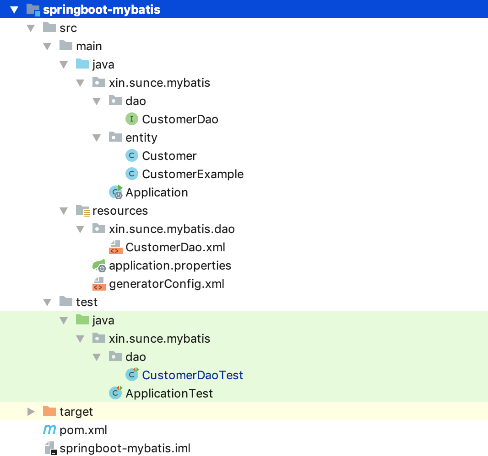
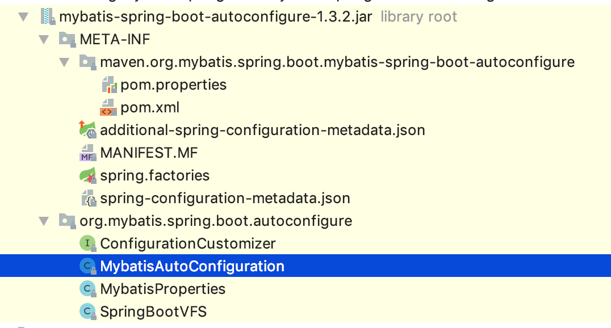

### SpringBoot集成MyBatis的使用以及源码浅析

演示环境

* mysql
* 构建工具maven

#### 项目演示

相对于spring集成mybatis，springboot集成mybatis在jar引用方面更加便捷，我们只用引入如下jar包即可：
```
<dependencies>
    <!-- springboot快速开始web服务 -->
    <dependency>
        <groupId>org.springframework.boot</groupId>
        <artifactId>spring-boot-starter-web</artifactId>
        <version>2.1.1.RELEASE</version>
    </dependency>
    <!-- 阿里数据源 -->
    <dependency>
        <groupId>com.alibaba</groupId>
        <artifactId>druid</artifactId>
        <version>1.1.10</version>
    </dependency>
    <!-- mysql -->
    <dependency>
        <groupId>mysql</groupId>
        <artifactId>mysql-connector-java</artifactId>
        <version>8.0.15</version>
    </dependency>
    <!-- 快速开始mybatis -->
    <dependency>
        <groupId>org.mybatis.spring.boot</groupId>
        <artifactId>mybatis-spring-boot-starter</artifactId>
        <version>1.3.2</version>
    </dependency>
    <!-- 快速开始测试 -->
    <dependency>
        <groupId>org.springframework.boot</groupId>
        <artifactId>spring-boot-starter-test</artifactId>
        <version>2.1.1.RELEASE</version>
    </dependency>
</dependencies>
```

设置application.properties配置文件

```
# 设置数据源类型
spring.datasource.type=com.alibaba.druid.pool.DruidDataSource
# 用户名
spring.datasource.username=root
# 密码
spring.datasource.password=1qaz1qaz!QAZ
# 地址
spring.datasource.url=jdbc:mysql://127.0.0.1:3306/test
# 数据库驱动类型
spring.datasource.driver-class-name=com.mysql.jdbc.Driver
# 指定mybatis的mapper文件路径
mybatis.mapper-locations=classpath:/xin/sunce/mybatis/dao/*.xml
# 指定mybatis的实体路径
mybatis.type-aliases-package=xin.sunce.mybatis.entity
```

创建Application.java

```
package xin.sunce.mybatis;

import org.mybatis.spring.annotation.MapperScan;
import org.springframework.boot.SpringApplication;
import org.springframework.boot.autoconfigure.SpringBootApplication;

// 设置dao层扫描注解
@MapperScan("xin.sunce.mybatis.dao")
@SpringBootApplication
public class Application {


    public static void main(String[] args) {
        SpringApplication.run(Application.class);
    }

}

```

创建测试类

```
package xin.sunce.mybatis.dao;


import org.junit.Test;
import org.junit.runner.RunWith;
import org.slf4j.Logger;
import org.slf4j.LoggerFactory;
import org.springframework.beans.factory.annotation.Autowired;
import org.springframework.boot.test.context.SpringBootTest;
import org.springframework.test.context.junit4.SpringRunner;
import xin.sunce.mybatis.Application;
import xin.sunce.mybatis.entity.Customer;


@RunWith(SpringRunner.class)
@SpringBootTest(classes = Application.class)
public class CustomerDaoTest {

    private Logger LOGGER = LoggerFactory.getLogger(this.getClass());

    @Autowired
    private CustomerDao customerDao;

    @Test
    public void testSelect() {
        Customer customer = customerDao.selectByPrimaryKey(1L);
        LOGGER.info(customer.toString());
    }


}
```
参考项目路径如下：



#### 源码浅析

在mybatis-spring-boot-starter这个jar包帮我们做了什么呢？我们仔细研究一下：
```
<dependencies>
    <dependency>
      <groupId>org.springframework.boot</groupId>
      <artifactId>spring-boot-starter</artifactId>
    </dependency>
    <dependency>
      <groupId>org.springframework.boot</groupId>
      <artifactId>spring-boot-starter-jdbc</artifactId>
    </dependency>
    <dependency>
      <groupId>org.mybatis.spring.boot</groupId>
      <artifactId>mybatis-spring-boot-autoconfigure</artifactId>
    </dependency>
    <dependency>
      <groupId>org.mybatis</groupId>
      <artifactId>mybatis</artifactId>
    </dependency>
    <dependency>
      <groupId>org.mybatis</groupId>
      <artifactId>mybatis-spring</artifactId>
    </dependency>
</dependencies>
```

我们发现mybatis-spring-boot-starter实质上就是一个pom文件，其中引入了spring-boot-starter，spring-boot-starter-jdbc，mybatis，mybatis-spring，mybatis-spring-boot-autoconfigure这些jar包，我们发现相较于spring整合mybatis多了mybatis-spring-boot-autoconfigure等jar包。

我们来看mybatis-spring-boot-autoconfigure的项目结构



核心类是MyBatisAutoConfiguration.java

```
@Configuration
@ConditionalOnClass({SqlSessionFactory.class, SqlSessionFactoryBean.class})
@ConditionalOnBean({DataSource.class})
//读入配置文件
@EnableConfigurationProperties({MybatisProperties.class})
@AutoConfigureAfter({DataSourceAutoConfiguration.class})
public class MybatisAutoConfiguration {

    //BeanFactory中无SqlSessionFactory实例时匹配，创建sqlSessionFactory实例
    @Bean
    @ConditionalOnMissingBean
    public SqlSessionFactory sqlSessionFactory(DataSource dataSource){...}

    //BeanFactory中无SqlSession实例时匹配，创建sqlSessionTemplate实例
    @Bean
    @ConditionalOnMissingBean
    public SqlSessionTemplate sqlSessionTemplate(SqlSessionFactory sqlSessionFactory) {...}
    
    //BeanFactory中无MapperFactoryBean实例时匹配，实现mapper文件的注册与配置
    @Configuration       @Import({MybatisAutoConfiguration.AutoConfiguredMapperScannerRegistrar.class})
    @ConditionalOnMissingBean({MapperFactoryBean.class})
    public static class MapperScannerRegistrarNotFoundConfiguration {...}

}
```

我们发现MybatisAutoConfiguration实现了对SqlSessionFactory，SqlSessionTemplate的默认配置，在缺少其相关实例时，会自动创建；而SqlSessionFactory，SqlSessionTemplate便是MyBatis的核心；

SqlSessionFactory的配置过程

```
public SqlSessionFactory sqlSessionFactory(DataSource dataSource) throws Exception {
    SqlSessionFactoryBean factory = new SqlSessionFactoryBean();
    //设置数据源
    factory.setDataSource(dataSource);
    factory.setVfs(SpringBootVFS.class);
    if (StringUtils.hasText(this.properties.getConfigLocation())) {
        factory.setConfigLocation(this.resourceLoader.getResource(this.properties.getConfigLocation()));
    }
    
    org.apache.ibatis.session.Configuration configuration = this.properties.getConfiguration();
    if (configuration == null && !StringUtils.hasText(this.properties.getConfigLocation())) {
        configuration = new org.apache.ibatis.session.Configuration();
    }

    if (configuration != null && !CollectionUtils.isEmpty(this.configurationCustomizers)) {
        Iterator var4 = this.configurationCustomizers.iterator();

        while(var4.hasNext()) {
            ConfigurationCustomizer customizer = (ConfigurationCustomizer)var4.next();
            customizer.customize(configuration);
        }
    }
    //设置configuration
    factory.setConfiguration(configuration);
    if (this.properties.getConfigurationProperties() != null) {
        factory.setConfigurationProperties(this.properties.getConfigurationProperties());
    }

    if (!ObjectUtils.isEmpty(this.interceptors)) {
        factory.setPlugins(this.interceptors);
    }

    if (this.databaseIdProvider != null) {
        factory.setDatabaseIdProvider(this.databaseIdProvider);
    }

    if (StringUtils.hasLength(this.properties.getTypeAliasesPackage())) {
        factory.setTypeAliasesPackage(this.properties.getTypeAliasesPackage());
    }

    if (StringUtils.hasLength(this.properties.getTypeHandlersPackage())) {
        factory.setTypeHandlersPackage(this.properties.getTypeHandlersPackage());
    }

    if (!ObjectUtils.isEmpty(this.properties.resolveMapperLocations())) {
        factory.setMapperLocations(this.properties.resolveMapperLocations());
    }

    return factory.getObject();
}
```
我们发现SqlSessionFactory的创建过程类似于Spring整合MyBatis时，利用SqlSessionFactoryBean来构建，期间完成了设置数据源，设置Configuration等重要的操作，最终通过factory.getObject()来获取SqlSessionFactory。


至于springboot是如何实现自动配置的，我们会在后面的文章中仔细的挖掘。


