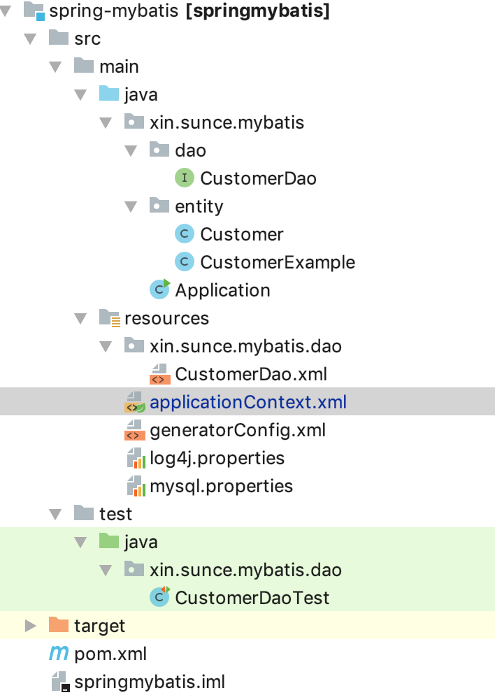
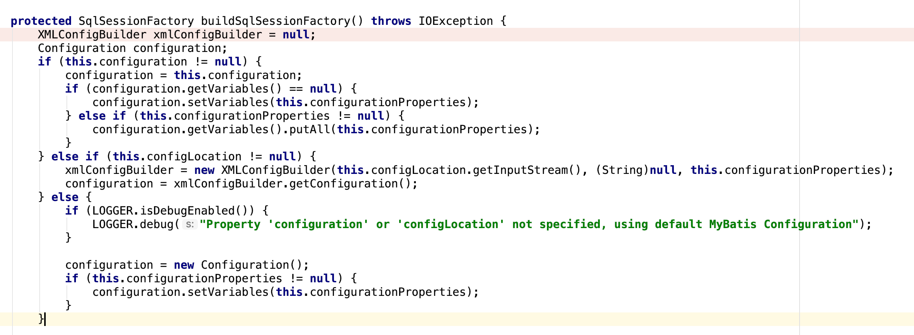

### Spring集成MyBatis的使用以及源码浅析

#### 使用Spring集成MyBatis

新建Spring的XML配置文件applicationContext.xml

```
<?xml version="1.0" encoding="UTF-8"?>
<beans xmlns="http://www.springframework.org/schema/beans"
       xmlns:xsi="http://www.w3.org/2001/XMLSchema-instance"
       xmlns:context="http://www.springframework.org/schema/context"
       xsi:schemaLocation="http://www.springframework.org/schema/beans
    http://www.springframework.org/schema/beans/spring-beans-3.0.xsd
     http://www.springframework.org/schema/context http://www.springframework.org/schema/context/spring-context.xsd">
    
    <!-- 解决变量 -->
    <context:property-placeholder location="classpath:mysql.properties"
                                  ignore-unresolvable="true"/>
    <!-- 配置数据源 -->
    <bean name="dataSource" class="com.alibaba.druid.pool.DruidDataSource"
          init-method="init" destroy-method="close">
        <property name="driverClassName" value="${driver}"/>
        <property name="url" value="${url}"/>
        <property name="username" value="${username}"/>
        <property name="password" value="${password}"/>
        <!-- 初始化连接大小 -->
        <property name="initialSize" value="0"/>
        <!-- 连接池最大使用连接数量 -->
        <property name="maxActive" value="20"/>
        <!-- 连接池最小空闲 -->
        <property name="minIdle" value="0"/>
        <!-- 获取连接最大等待时间 -->
        <property name="maxWait" value="60000"/>
        <property name="validationQuery" value="${validationQuery}"/>
        <property name="testOnBorrow" value="true"/>
        <property name="testOnReturn" value="false"/>
        <property name="testWhileIdle" value="true"/>
        <!-- 配置间隔多久才进行一次检测，检测需要关闭的空闲连接，单位是毫秒 -->
        <property name="timeBetweenEvictionRunsMillis" value="60000"/>
        <!-- 配置一个连接在池中最小生存的时间，单位是毫秒 -->
        <property name="minEvictableIdleTimeMillis" value="25200000"/>
        <!-- 打开removeAbandoned功能 -->
        <property name="removeAbandoned" value="true"/>
        <!-- 1800秒，也就是30分钟 -->
        <property name="removeAbandonedTimeout" value="1800"/>
        <!-- 关闭abanded连接时输出错误日志 -->
        <property name="logAbandoned" value="true"/>
        <!-- 监控数据库 -->
        <!-- <property name="filters" value="stat" /> -->
        <property name="filters" value="mergeStat"/>
    </bean>
    
    <!-- 配置SqlSessionFactory -->
    <bean id="sqlSessionFactory" class="org.mybatis.spring.SqlSessionFactoryBean">
        <property name="dataSource" ref="dataSource"/>
        <!-- 配置数据库表对应的java实体类 -->
        <property name="typeAliasesPackage" value="xin.sunce.mybatis.entity"/>
        <!-- 自动扫描entity目录, 省掉Configuration.xml里的手工配置 -->
        <property name="mapperLocations" value="classpath:/xin/sunce/mybatis/dao/*.xml"/>
    </bean>
    
    <!-- 配置MapperScannerConfigurer -->
    <bean class="org.mybatis.spring.mapper.MapperScannerConfigurer">
        <property name="basePackage" value="xin.sunce.mybatis.dao"/>
        <property name="sqlSessionFactoryBeanName" value="sqlSessionFactory"/>
    </bean>
</beans>
```

项目结果如下图所示：




执行测试用例：

```
public class CustomerDaoTest {

    private Logger LOGGER = Logger.getLogger(this.getClass());

    private ApplicationContext applicationContext;

    @Before
    public void getContext() {
        applicationContext = new ClassPathXmlApplicationContext("applicationContext.xml");
    }

    @Test
    public void testSelect() {
        CustomerDao customerDao = applicationContext.getBean(CustomerDao.class);
        Customer customer = customerDao.selectByPrimaryKey(1L);
        LOGGER.info(customer);
    }

}
```


#### 源码导读

我们知道MyBatis的核心是SqlSessionFactory，那么我们来看看Spring集成MyBatis，如何来生成SqlSeessionFactory的呢？我们再回顾一下配置文件：

```
<!-- 配置SqlSessionFactory -->
<bean id="sqlSessionFactory" class="org.mybatis.spring.SqlSessionFactoryBean">
    <property name="dataSource" ref="dataSource"/>
    <!-- 配置数据库表对应的java实体类 -->
    <property name="typeAliasesPackage" value="xin.sunce.mybatis.entity"/>
    <!-- 自动扫描entity目录, 省掉Configuration.xml里的手工配置 -->
    <property name="mapperLocations" value="classpath:/xin/sunce/mybatis/dao/*.xml"/>
</bean>
```

以上文件我们配置了SqlSessionFactoryBean，并设置了成员变量dataSource，typeAliasesPackage，mapperLocations的值，接下来我们去SqlSessionFactoryBean源码看看究竟：

```
public class SqlSessionFactoryBean implements FactoryBean<SqlSessionFactory>, InitializingBean, ApplicationListener<ApplicationEvent>
```

首先我们看到SqlSessionFactoryBean 实现了FactoryBean<T>,InitializingBean,ApplicationListener这些接口

ApplicationListener<ApplicationEvent>实现方法如下：
```
//此接口实现应用事件的监听机制
public void onApplicationEvent(ApplicationEvent event) {
    if (this.failFast && event instanceof ContextRefreshedEvent) {
      this.sqlSessionFactory.getConfiguration().getMappedStatementNames();
    }
}
```
FactoryBean<T> 接口实现：
```
public interface FactoryBean<T> {
    @Nullable
    T getObject() throws Exception;

    @Nullable
    Class<?> getObjectType();

    default boolean isSingleton() {
        return true;
    }
}

//实现如下：
public SqlSessionFactory getObject() throws Exception {
    if (this.sqlSessionFactory == null) {
        this.afterPropertiesSet();
    }
    return this.sqlSessionFactory;
}

public Class<? extends SqlSessionFactory> getObjectType() {
    return this.sqlSessionFactory == null ? SqlSessionFactory.class : this.sqlSessionFactory.getClass();
}

//实现的FactoryBean是单例的，保证了线程安全
public boolean isSingleton() {
    return true;
}


```

InitializingBean接口实现：
```
public void afterPropertiesSet() throws Exception {
        Assert.notNull(this.dataSource, "Property 'dataSource' is required");
        Assert.notNull(this.sqlSessionFactoryBuilder, "Property 'sqlSessionFactoryBuilder' is required");
        Assert.state(this.configuration == null && this.configLocation == null || this.configuration == null || this.configLocation == null, "Property 'configuration' and 'configLocation' can not specified with together");
        this.sqlSessionFactory = this.buildSqlSessionFactory();
    }
```

此接口在初始化Bean的时候调用，最终会调用buildSqlSessionFactory来初始化sqlSessionFactory；而buildSqlSessionFactory的过程实质上就是组装Configuration，然后利用SqlSessionFactoryBuilder构建的过程；




```
//设置configuration
if (this.objectFactory != null) {
    configuration.setObjectFactory(this.objectFactory);
}

if (this.objectWrapperFactory != null) {
    configuration.setObjectWrapperFactory(this.objectWrapperFactory);
}

if (this.vfs != null) {
    configuration.setVfsImpl(this.vfs);
}
......
configuration.setEnvironment(new Environment(this.environment, this.transactionFactory, this.dataSource));
......
//根据configuration构建SqlSessionFactory
return this.sqlSessionFactoryBuilder.build(configuration);

```

以上便是构建生成SqlSessionFactory的过程。


